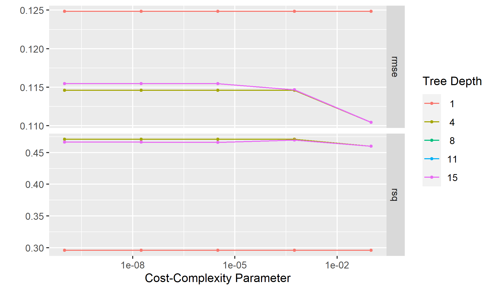

# Summary/Abstract
In past pandemics, vulnerable populations faced greater disease burden and decreased testing and treatment access.1 As coronavirus disease 2019 (COVID-19) spreads in the USA, concern is growing that even the early stages of this pandemic have disproportionately impacted vulnerable communities.2–4 However, the relationship between social vulnerability and ethnicity remains unknown.

# KEY QUESTIONS 

What is already known about this subject?

COVID-19 has disproportionally affected racial/ethnic minority groups.

What will this study add or answer?

The present analysis will attempt to estimate the percent of the population in each US region that may be heistant to get a vaccine.

Relationship between ethnicity and social vulnerability index

How might this impact clinical practice?

Identify and address barriers to COVID-19 vaccination. Continued monitoring of vaccination coverage by social vulnerability metrics is critical for developing tailored, local vaccine administration and outreach efforts to reduce COVID-19 vaccination inequities.


## General Background Information

Coronavirus disease (COVID-19) is an infectious disease caused by a newly discovered coronavirus. Coronavirus disease 2019 (COVID-19) was declared a pandemic in March 2020. COVID-19 vaccine is the most sustainable option to manage the current pandemic.Since its discovery in February 2020 in the United States (U.S.) [@Jernigan2020], community transmission of SARS-COV-2, which causes COVID-19, has resulted in more than 600,000 deaths and 34 million cases across the country [CDC
@COVID Data Tracker]. Across demographic characteristics such as age, race and ethnicity, and income, there are considerable variations in COVID-19 incidence [@Neelon2021,@Li2020], severity [@Neelon2021,@Li2020], mortality [@Chen2020], as well as in testing and resource allocation [@Lewis2020]. In order to understand the function of social vulnerability in relation to COVID-19, it is necessary to examine the evidence. Evidence indicates that populations suffering higher social vulnerability bear a disproportionate burden of COVID-19 morbidity and mortality [@Dasgupta2020]. Among other things, disparities in COVID-19 outcomes may be explained by differences in where people live and work [@Chen2020], a lack of public health initiatives, and limitations to physical distancing, such as the inability to work from home. However, vaccine hesitancy by even a small subset of the population can undermine the success of this strategy. The Social Vulnerability Index (SVI) is a tool that uses census data to identify and map places where a community may have more difficulty preventing human suffering and financial loss in a disaster.The SVI assesses the extent that 15 known vulnerabilities (indicators) are present within a community and categorizes them into four themes: socioeconomic status, household composition and disability, minority status and language minority and housing type and transportation. Indicators like poverty and transportation can highlight places where people may have difficulty accessing COVID-19 testing, treatment and vaccination[@Hughes2021]


## Description of data and data source
_Describe what the data is, what it contains, where it is from, etc. Eventually this might be part of a methods section._

The dataset used for this analysis is publicly available on CDC website. https://data.cdc.gov/Vaccinations/Vaccine-Hesitancy-for-COVID-19-County-and-local-es/q9mh-h2tw

Social Vulnerability Index
Overall social vulnerability index was obtained from the 2018 CDC Social Vulnerability Index.  The CDC's Social Vulnerability Index (SVI) summarizes the extent to which a community is socially vulnerable to disaster.[@Hughes2021] The factors considered in developing the SVI include economic data as well as data regarding education, family characteristics, housing language ability, ethnicity, and vehicle access. SVI values range from 0 (least vulnerable) to 1 (most vulnerable). The SVI can also be categorized as follows: 

1) Very Low (0.0-0.19);
2) Low (0.20-0.39); 
3) Moderate (0.40-0.59); 
4) High (0.60-0.79); 
5) Very High (0.80-1.0). 


COVID-19 Vaccine Coverage Index

The Surgo Covid-19 Vaccine Coverage Index (CVAC) captures supply- and demand-related challenges that may hinder rapid, widespread COVID-19 vaccine coverage in U.S. counties, through five specific themes: historic undervaccination, sociodemographic barriers, resource-constrained healthcare system, healthcare accessibility barriers, and irregular care-seeking behaviors. The CVAC measures the level of concern for a difficult rollout on a range from 0 (lowest concern) to 1 (highest concern).The CVAC Index can also be categorized as follows:

  
1) Very Low (0.0-0.19);
2) Low (0.20-0.39); 
3) Moderate (0.40-0.59); 
4) High (0.60-0.79); 
5) Very High (0.80-1.0). 


## Questions/Hypotheses to be addressed
_State the research questions you plan to answer with this analysis._

The present analysis will attempt to estimate the percent of the population in each county that may be vaccine hesitant

Relationship between ethnicity and  vaccine hesitancy

# Future analysis

I plan to present a summary of social vulnerability index based on race and ethnicity. I will plot some graphs (box-plot, scatter plot). I am also planning to do some regression analysis too


# Methods and Results

_In most research papers, results and methods are separate. You can combine them here if you find it easier. You are also welcome to structure things such that those are separate sections._


## Data aquisition
_As applicable, explain where and how you got the data. If you directly import the data from an online source, you can combine this section with the next._

## Data import and cleaning

## Exploratory analysis


##BAR Charts

##                        Figure 1

##Bar Chart of Frequency of Northeast states by SVI category  

```{r Northeast_state_data,  fig.cap='', echo=FALSE}
knitr::include_graphics("../../results/Northeast_SVI_Bar.png")
```

##                        Figure 2

##Bar Chart of Frequency of Midwest states by SVI category  

```{r Midwest_state_data,  fig.cap='', echo=FALSE}
knitr::include_graphics("../../results/Midwest_SVI_Bar.png")
```

##                        Figure 3

##Bar Chart of Frequency of West states by SVI category  

```{r West_state_data,  fig.cap='', echo=FALSE}
knitr::include_graphics("../../results/West_SVI_Bar.png")
```


##                        Figure 4

##Bar Chart of Frequency of South states by SVI category  

```{r South_state_data,  fig.cap='', echo=FALSE}
knitr::include_graphics("../../results/South_SVI_Bar.png")
```


## Full analysis

# fit linear model

# Create a linear model of  Percent fully vaccinated and race in all regions

```{r   echo=FALSE}
resulttable=readRDS("../../results/resulttable.rds")
knitr::kable(resulttable, caption = 'Linear model fit table.')
```

```{r  fig.cap='', echo=FALSE}

```


# Discussion

The US COVID-19 vaccination program prioritizes ensuring fair COVID-19 vaccine access. Immunization coverage was lower in high-vulnerability areas across the country, indicating that more work is needed to ensure equity in vaccination coverage for those most affected by COVID-19 [@Thakore2021-xf]. COVID-19 vaccine coverage must be improved in communities with high proportions of racial/ethnic minority groups and those who are economically and socially marginalized, because COVID-19–related illness and mortality have disproportionately affected these populations.Monitoring community-level measurements is crucial for developing personalized, local vaccine delivery strategies that could help to eliminate disparities.[@Subramanian2021] Access concerns (e.g., vaccine supply, vaccination clinic availability, and lack of prioritizing of vulnerable populations) or other challenges, such as vaccine hesitancy, might be investigated by public health officials. Vaccination promotion, outreach, and administration may be concentrated in counties with high sensitivity populations (e.g., providing resources to federally qualified health centers when socioeconomic disparities are identified).[@Fletcher2021]

For the socioeconomic status variables (i.e., poverty, unemployment, low income, and no high school diploma), vaccination coverage was consistently lower in high vulnerability counties than in low vulnerability counties; the coverage discrepancy was greatest for the education indicator[@Khazanchi2020,@Biggs2021]. However, for the indicators relating to the percentages of people who speak English poorly and people with disabilities, equal vaccination coverage was observed in counties with low and high social vulnerability, which is encouraging given the disproportionate incidence of COVID-19 in these populations.

COVID-19 immunization coverage differed by state. In most states, low vulnerability counties had more coverage than high vulnerability counties.[@Islam2021,@Jay2020] Despite this, states like Arizona and Montana have higher vaccination coverage in high-risk areas based on SVI indicators. In states with high equity, practices included: 1) prioritizing people from racial/ethnic minority groups during the early stages of vaccine program implementation, 2) actively monitoring and addressing barriers to vaccination in vulnerable communities, 3) directing vaccines to vulnerable communities, 4) providing free transportation to vaccination sites, and 5) collaborating with community partners, tribal health organizations, and the Indian Health Service.

##  Limitations
In each state, specific populations were prioritized for vaccination; the disparities seen could be attributed to prioritizing based on age, occupational exposures, and underlying health issues.

Vulnerabilities and vaccine coverage rates may differ by county; state and municipal governments may prioritize immunization efforts for high risk communities in smaller geographic entities.

## Conclusions
COVID-19 vaccination coverage was lower in high exposure counties than in low vulnerability counties, according to the findings, which was mostly due to socioeconomic discrepancies. As vaccine supplies grow and administration expands to more priority groups, the CDC, states, and local governments should continue to track vaccination rates using SVI metrics to aid in the development of community-based efforts to improve vaccination access, outreach, and administration among COVID-19-affected populations.


# References


